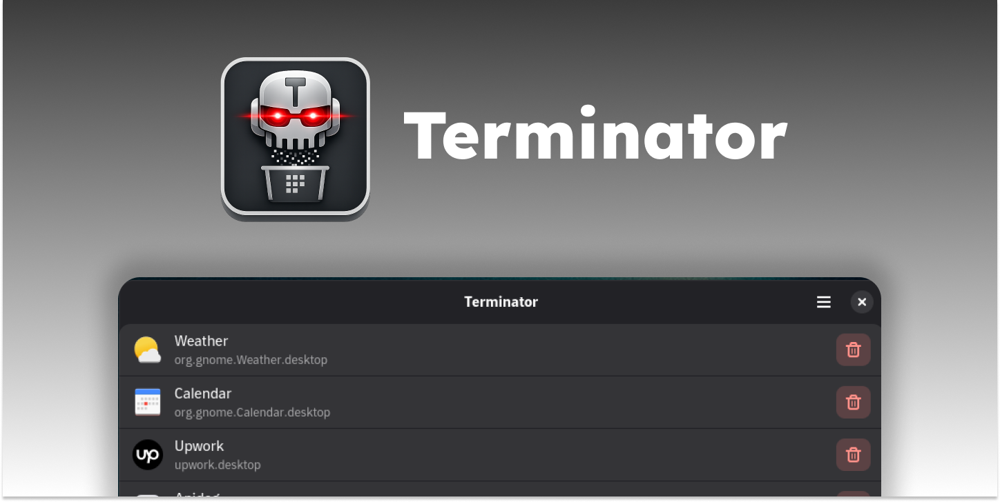

A simple but powerful tool for managing installed applications on your linux machine. Whether you installed an app through your system's package manager, Flatpak, or Snap, Terminator provides a unified interface to view and remove them all from one place.

## Features

- Browse installed applications with their icons and identifiers
- Remove system packages, AppImages, Flatpaks, and Snaps from the same interface
- Confirmation and authentication dialogs prevent accidental uninstallations
- Search and filter installed apps by name or type

## Supported Package Types

- System packages
- User-local packages
- Flatpak
- Snap
- AppImage

## Installation

### Arch Linux (AUR)

```bash
yay -S app-terminator
```

Or with any other AUR helper (`paru`, `pikaur`, etc.).

### Fedora

```bash
sudo dnf config-manager addrepo --from-repofile=https://download.opensuse.org/repositories/home:/r6mez/Fedora_$(rpm -E %fedora)/home:r6mez.repo
sudo dnf install app-terminator
```

### Ubuntu / Debian

A PPA is coming soon. For now, please build from source — see [CONTRIBUTING.md](CONTRIBUTING.md).

## License

Terminator is free software released under the [GNU General Public License v3.0](COPYING) or later.

## Contributing

Contributions are welcome! Feel free to open issues or submit pull requests. See [CONTRIBUTING.md](CONTRIBUTING.md) for build instructions.
