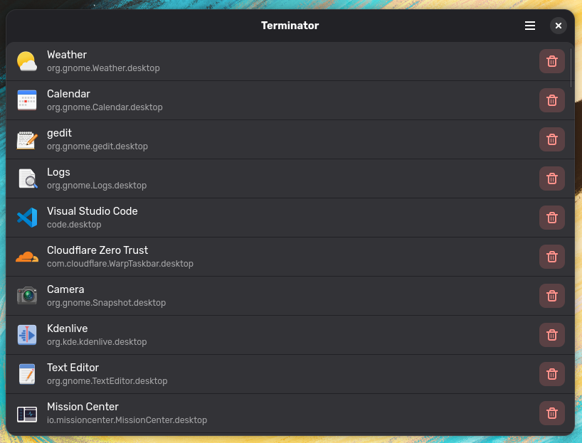

# Terminator

Terminator is a simple but powerful tool for managing installed applications on your GNOME desktop. Whether you installed an app through your system's package manager, Flatpak, or Snap, Terminator provides a unified interface to view and remove them all from one place.



## Features

- **See all your apps** — Browse installed applications with their icons and identifiers
- **Universal uninstaller** — Remove system packages, Flatpaks, and Snaps from the same interface
- **Safe removal** — Confirmation dialogs prevent accidental uninstallations
- **Secure by design** — Uses PackageKit and Polkit for authenticated system changes
- **Native GNOME experience** — Built with GTK4 and libadwaita for a modern, consistent look

## Installation

### Building from Source

Terminator uses the Meson build system. To build and install:

```bash
meson setup build
meson compile -C build
meson install -C build
```

Or run directly from the build directory without installing:

```bash
meson setup build
meson compile -C build
./build/src/org.ramez.terminator
```

### Dependencies

You'll need these installed before building:

**Build Dependencies**
- meson (>= 1.0.0)
- gjs

**Runtime Dependencies**
- gjs
- gtk4
- libadwaita
- packagekit (for uninstalling system packages)
- A PolicyKit authentication agent like polkit-gnome (for authentication dialogs)

#### Arch Linux

```bash
sudo pacman -S gjs gtk4 libadwaita packagekit polkit-gnome
```

#### Fedora

```bash
sudo dnf install gjs gtk4 libadwaita PackageKit polkit-gnome
```

#### Ubuntu/Debian

```bash
sudo apt install gjs libgtk-4-1 libadwaita-1-0 packagekit policykit-1-gnome
```

## License

Terminator is free software released under the [GNU General Public License v3.0](COPYING) or later.

## Contributing

Contributions are welcome! Feel free to open issues or submit pull requests.
